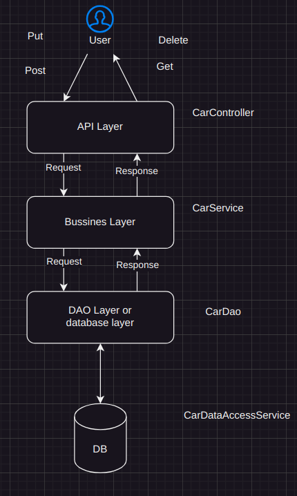

## Project name:

SPRING BOOT AND HIBERNATE ORM

## Requirements:

- Maven: apache-maven-3.6.3 - up
- Java version: 17.0.7 - up

## To run the project in VsCode

Extensions:

- Lombok Annotations Support for VS Code
- Language Support for Java(TM) by Red Hat
- Extension Pack for Java
- Debugger for Java
- Maven for Java
- Project Manager for Java
- Test Runner for Java
- Draw.io Integration

## To run the project

- Go to: src/main/java/com/example/demo/DemoApplication.java
- Right click the file and select Run Java or Debug Java to enter debug mode

## In case the packages are not installed automatically do:

- mvn clean package

## To run tests run the command

- mvn test

## Skip tests

- DskipTests=true

## Relevant links for documentation:

- Security: https://github.com/spring-projects/spring-data-examples/tree/main/rest/security
- Template: https://docs.spring.io/spring-data/mongodb/docs/current/api/org/springframework/data/mongodb/core/MongoTemplate.html
- Mongo Docs: https://docs.spring.io/spring-data/mongodb/docs/current/reference/html/?fbclid=IwAR0b43uX2mPBG51eI6jExXUazAIWpLNfmwwElzT4wAWxzdjIFSe4vY8gjNo
- Mongock: https://docs.mongock.io/v5/migration/index.html#changeunit-methods

## Common issues:

## Diagram:

open schema.drawio

## Exposed API:

/api/v1/cars -CRUD
